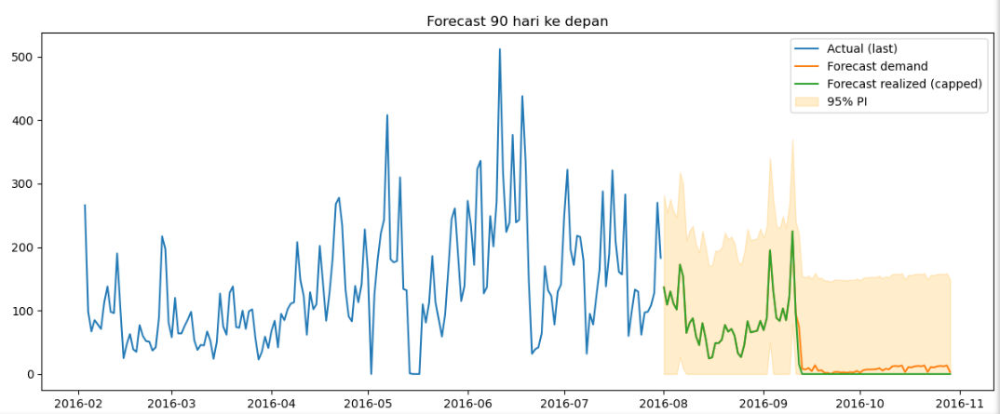

# Proyek Analisis Permintaan dan Perencanaan Inventori

Repositori ini berisi analisis data penjualan untuk mengukur sensitivitas permintaan terhadap harga, melakukan peramalan permintaan, dan mensimulasikan tingkat inventori untuk mengidentifikasi risiko kekurangan stok (*stockout*) secara lebih proaktif.

---

## Latar Belakang & Tujuan Proyek

Manajemen inventori yang reaktif sering kali menyebabkan dua masalah utama: kehilangan potensi penjualan akibat kehabisan stok, dan biaya penyimpanan yang tinggi karena kelebihan stok. Proyek ini bertujuan untuk membantu mengurangi masalah tersebut dengan membangun sebuah kerangka kerja berbasis data untuk:

1. **Mengukur Dampak Harga:** Memahami secara kuantitatif seberapa besar pengaruh perubahan harga terhadap volume penjualan.
2. **Meramalkan Permintaan:** Membuat model peramalan yang lebih akurat untuk memprediksi penjualan di masa depan.
3. **Mendukung Keputusan Inventori:** Mensimulasikan tingkat stok untuk memberikan peringatan dini terhadap potensi risiko *stockout* di bawah berbagai skenario.

Kerangka kerja ini berfokus pada **analisis dan simulasi** sebagai fondasi untuk kebijakan inventori yang lebih optimal. Modul optimisasi penuh (misalnya penentuan safety stock atau kebijakan (s, S)) dapat dibangun di atas komponen-komponen ini pada tahap berikutnya.

---

## Proses Analisis

Analisis ini dibagi menjadi beberapa tahap utama:

1. **Pembersihan Data (*Data Cleaning*):**  
   Mempersiapkan data mentah dengan mengisi tanggal yang hilang, menangani nilai anomali (seperti harga <= 0), dan menstandarisasi format untuk analisis.

2. **Dekomposisi *Time Series*:**  
   Menggunakan metode **STL** untuk mengidentifikasi komponen tren jangka panjang dan pola musiman mingguan dalam data penjualan.

3. **Analisis Elastisitas & Peramalan:**  
   - Membangun beberapa spesifikasi model **regresi log–log** (termasuk dengan **Year–Month Fixed Effects** dan filter observasi dengan stok awal tinggi) untuk mengestimasi elastisitas harga sekaligus mengurangi bias akibat musiman dan keterbatasan stok.  
   - Mengembangkan model peramalan permintaan harian dan mengevaluasi kinerjanya terhadap metode baseline pada periode uji yang sama.  
     Model yang dipilih menunjukkan **MASE ≈ 0.97** dibanding baseline dengan **MASE ≈ 1.69**, atau sekitar **40% perbaikan** berdasarkan metrik ini.

Detail lengkap setiap spesifikasi model dan langkah teknis dapat dilihat di notebook analisis utama.

---

## Temuan Utama & Hasil

### 1. Estimasi Elastisitas Harga Sekitar -1.6

Analisis menunjukkan hubungan negatif yang cukup kuat antara harga dan penjualan:

- Model log–log dengan **Year–Month Fixed Effects** dan filter observasi saat stok relatif tinggi menghasilkan estimasi elastisitas harga sekitar **-1.68**.  
- Spesifikasi alternatif berbasis perubahan harian (`Δlog Sales` terhadap `Δlog Price`) menghasilkan elastisitas sekitar **-1.08**, dengan sign dan orde besaran yang konsisten.

Secara ekonomi, angka ini dapat dibaca sebagai: **setiap kenaikan harga 1% diperkirakan menurunkan volume penjualan di kisaran 1–1.7%**, bergantung pada spesifikasi model.  

Karena data yang digunakan bersifat observasional (bukan hasil A/B test atau model *instrumental variables*), estimasi ini tidak diklaim sebagai “kausal sempurna”, tetapi memberikan **indikasi kuantitatif yang berguna** untuk mengevaluasi skenario perubahan harga, dengan asumsi bahwa variasi harga harian dalam bulan pada kondisi stok tinggi tidak sepenuhnya didorong oleh shock permintaan yang tak terukur.

---

### 2. Peramalan Mengungkap Risiko Stockout Kritis

Puncak dari analisis ini adalah simulasi inventori yang menggunakan hasil peramalan permintaan. Visualisasi di bawah ini merangkum keseluruhan cerita:

- **Permintaan Pasar (Garis Oranye):**  
  Menunjukkan prediksi permintaan yang tetap ada sepanjang periode analisis.
- **Realisasi Penjualan (Garis Hijau):**  
  Mensimulasikan penjualan aktual yang *mungkin terjadi* mengingat level stok awal dan kebijakan pengisian ulang (replenishment) yang diasumsikan.

Pada skenario stok awal dan pola pemesanan yang disimulasikan, grafik menunjukkan bahwa terdapat **risiko stockout penuh** sekitar pertengahan September: stok habis sehingga penjualan turun ke nol, meskipun model masih memprediksi adanya permintaan pasar.

Temuan ini mengindikasikan perlunya:

- penyesuaian level stok awal dan/atau frekuensi pemesanan, dan
- penguatan proses perencanaan inventori agar tidak hanya reaktif terhadap *stockout* yang sudah terjadi.



---

## Tools & Library yang Digunakan

- **Bahasa:** Python 3  
- **Data Analysis:** `pandas`, `numpy`  
- **Statistical Modeling:** `statsmodels`  
- **Visualization:** `matplotlib`, `seaborn`  
- **Machine Learning / Forecasting:** `scikit-learn`  
- **Environment:** Jupyter Notebook
  
---

## Cara Menjalankan Proyek
1.  **Clone repositori ini:**
    ```bash
    git clone [https://github.com/GagahBima/Proyek-Analisis-Permintaan-dan-Optimalisasi-Inventori]
    ```
2.  **Install dependensi yang dibutuhkan:**
    ```bash
    pip install pandas numpy matplotlib seaborn statsmodels scikit-learn
    ```
3.  **Jalankan notebook secara berurutan:**
    * Mulai dengan `Data_Cleaning.ipynb`.
    * Lanjutkan dengan notebook analisis utama `Main__Analysis.ipynb`.

---

## Batasan & Asumsi

* Data yang digunakan bersifat **observasional**, bukan hasil eksperimen terkontrol.
* Estimasi elastisitas harga mengandalkan asumsi bahwa variasi harga harian di dalam bulan, pada kondisi stok yang tidak mengikat, **tidak sepenuhnya didorong oleh shock permintaan tak terukur**.
* Hasil peramalan dan simulasi pada repo ini berlaku untuk **produk dan periode yang dianalisis**, dan belum tentu langsung dapat digeneralisasi ke kategori lain tanpa penyesuaian lebih lanjut.
* Prototipe ini difokuskan pada analisis dan simulasi; modul optimisasi kebijakan inventori penuh (misalnya penentuan safety stock optimal) **belum diimplementasikan** dan dapat menjadi pengembangan lanjutan.
